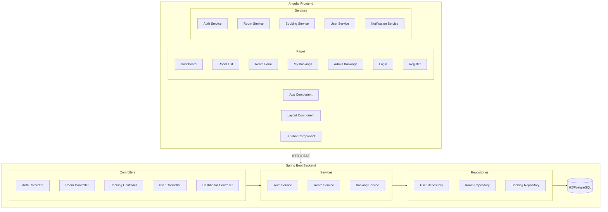

# Design Document: Room Reservation System Completion

## Overview

This design document outlines the technical approach for completing the Room Reservation System with a responsive frontend using the SESAME color palette, missing backend functionality, and proper frontend-backend integration. The system follows a monolithic architecture with a Spring Boot backend and Angular frontend.

## Architecture



## Components and Interfaces

### Frontend Components

#### 1. Layout Component
Provides the main application shell with responsive sidebar navigation.

```typescript
interface LayoutComponent {
  isSidebarOpen: boolean;
  currentUser: User | null;
  toggleSidebar(): void;
}
```

#### 2. Sidebar Component
Responsive navigation sidebar with role-based menu items.

```typescript
interface MenuItem {
  label: string;
  icon: string;
  route: string;
  adminOnly: boolean;
}

interface SidebarComponent {
  menuItems: MenuItem[];
  isOpen: boolean;
  currentRoute: string;
}
```

#### 3. Dashboard Component (Enhanced)
Displays statistics and recent bookings.

```typescript
interface DashboardStats {
  totalRooms: number;
  myBookingsCount: number;
  pendingBookingsCount: number;
  totalUsers?: number; // Admin only
  allPendingCount?: number; // Admin only
}

interface RecentBooking {
  id: number;
  roomName: string;
  startTime: string;
  endTime: string;
  status: BookingStatus;
}
```

#### 4. Room List Component (Enhanced)
Responsive room display with admin actions.

```typescript
interface RoomListComponent {
  rooms: Room[];
  isAdmin: boolean;
  viewMode: 'grid' | 'table';
  onEdit(room: Room): void;
  onDelete(room: Room): void;
  onBook(room: Room): void;
}
```

#### 5. My Bookings Component
User's booking history with cancellation.

```typescript
interface MyBookingsComponent {
  bookings: Booking[];
  onCancel(booking: Booking): void;
}
```

#### 6. Admin Bookings Component
Admin interface for booking approval.

```typescript
interface AdminBookingsComponent {
  pendingBookings: Booking[];
  onApprove(booking: Booking): void;
  onReject(booking: Booking): void;
}
```

### Frontend Services

#### Room Service
```typescript
interface RoomService {
  getAllRooms(): Observable<Room[]>;
  getRoomById(id: number): Observable<Room>;
  createRoom(room: Room): Observable<Room>;
  updateRoom(id: number, room: Room): Observable<Room>;
  deleteRoom(id: number): Observable<void>;
}
```

#### Booking Service
```typescript
interface BookingService {
  createBooking(request: BookingRequest): Observable<Booking>;
  getMyBookings(): Observable<Booking[]>;
  cancelBooking(id: number): Observable<void>;
  getAllBookings(): Observable<Booking[]>; // Admin
  approveBooking(id: number): Observable<Booking>; // Admin
  rejectBooking(id: number): Observable<Booking>; // Admin
}
```

#### User Service
```typescript
interface UserService {
  getCurrentUser(): Observable<User>;
}
```

#### Notification Service
```typescript
interface NotificationService {
  success(message: string): void;
  error(message: string): void;
  info(message: string): void;
}
```

### Backend Endpoints

#### User Controller (New)
```
GET /api/v1/users/me -> UserDTO { id, email, firstName, lastName, role }
```

#### Booking Controller (Enhanced)
```
DELETE /api/v1/bookings/{id} -> 204 No Content (cancel own pending booking)
```

## Data Models

### Frontend Models

```typescript
interface User {
  id: number;
  email: string;
  firstName: string;
  lastName: string;
  role: 'USER' | 'ADMIN';
}

interface Room {
  id: number;
  name: string;
  capacity: number;
  location: string;
  equipments: string;
}

interface Booking {
  id: number;
  user: User;
  room: Room;
  startTime: string;
  endTime: string;
  status: 'PENDING' | 'APPROVED' | 'REJECTED' | 'CANCELLED';
}

interface BookingRequest {
  roomId: number;
  startTime: string;
  endTime: string;
}
```

### Backend DTOs

```java
public class UserDTO {
    private Long id;
    private String email;
    private String firstName;
    private String lastName;
    private Role role;
}
```

## SESAME Color Theme

### Color Palette
```scss
$sesame-primary: #00478F;      // Primary Blue
$sesame-secondary: #22C0C2;    // Secondary Teal
$sesame-accent: #21C0C2;       // Accent Teal
$sesame-dark: #00488F;         // Dark Blue

// Derived colors
$sesame-primary-light: #1a5a9e;
$sesame-primary-dark: #003366;
$sesame-background: #f5f7fa;
$sesame-surface: #ffffff;
$sesame-text: #333333;
$sesame-text-light: #666666;

// Status colors
$status-pending: #f59e0b;      // Amber
$status-approved: #10b981;     // Green
$status-rejected: #ef4444;     // Red
$status-cancelled: #6b7280;    // Gray
```

### Responsive Breakpoints
```scss
$breakpoint-mobile: 480px;
$breakpoint-tablet: 768px;
$breakpoint-desktop: 1024px;
$breakpoint-wide: 1280px;
```


## Correctness Properties

*A property is a characteristic or behavior that should hold true across all valid executions of a system-essentially, a formal statement about what the system should do. Properties serve as the bridge between human-readable specifications and machine-verifiable correctness guarantees.*

### Property 1: Role-Based UI Visibility
*For any* user with role USER (non-admin), admin-only navigation items and admin statistics SHALL be hidden from the UI.
**Validates: Requirements 2.2, 3.4**

### Property 2: Sidebar Toggle Idempotence
*For any* initial sidebar state, clicking the toggle button twice SHALL return the sidebar to its original state.
**Validates: Requirements 2.3**

### Property 3: Pending Booking Cancellation Availability
*For any* booking with status PENDING that belongs to the current user, the cancel action SHALL be available and enabled.
**Validates: Requirements 5.2**

### Property 4: Admin Approve/Reject Actions for Pending Bookings
*For any* booking with status PENDING, when viewed by an admin, approve and reject actions SHALL be available.
**Validates: Requirements 5.4, 6.2, 6.3**

### Property 5: Booking Approval Status Transition
*For any* pending booking, when an admin approves it, the booking status SHALL transition to APPROVED.
**Validates: Requirements 6.2**

### Property 6: Booking Rejection Status Transition
*For any* pending booking, when an admin rejects it, the booking status SHALL transition to REJECTED.
**Validates: Requirements 6.3**

### Property 7: User Profile Response Structure
*For any* authenticated user, the GET /api/v1/users/me endpoint SHALL return a response containing id, email, firstName, lastName, and role, but SHALL NOT contain password or passwordHash.
**Validates: Requirements 7.1, 7.2**

### Property 8: Own Pending Booking Cancellation
*For any* booking that belongs to the current user and has status PENDING, DELETE /api/v1/bookings/{id} SHALL successfully cancel the booking.
**Validates: Requirements 8.1**

### Property 9: Cross-User Booking Cancellation Prevention
*For any* booking that does NOT belong to the current user, DELETE /api/v1/bookings/{id} SHALL return 403 Forbidden.
**Validates: Requirements 8.2**

### Property 10: Non-Pending Booking Cancellation Prevention
*For any* booking with status APPROVED, REJECTED, or CANCELLED, DELETE /api/v1/bookings/{id} SHALL return 400 Bad Request.
**Validates: Requirements 8.3**

## Error Handling

### Frontend Error Handling

1. **HTTP Interceptor**: Global error interceptor catches all HTTP errors
   - 401 Unauthorized: Redirect to login, clear token
   - 403 Forbidden: Display "Access Denied" message
   - 400 Bad Request: Display validation error from response
   - 500 Server Error: Display generic error message

2. **Notification Service**: Centralized toast notifications
   - Success: Green toast, auto-dismiss after 3 seconds
   - Error: Red toast, requires manual dismiss
   - Info: Blue toast, auto-dismiss after 5 seconds

3. **Form Validation**: Client-side validation with error messages
   - Required fields highlighted
   - Email format validation
   - Date/time validation (end > start)

### Backend Error Handling

1. **Global Exception Handler**: Catches and formats all exceptions
   - `IllegalArgumentException`: 400 Bad Request
   - `IllegalStateException`: 409 Conflict
   - `AccessDeniedException`: 403 Forbidden
   - `EntityNotFoundException`: 404 Not Found

2. **Error Response Format**:
```json
{
  "error": "Error message",
  "timestamp": "2025-01-06T10:00:00",
  "status": 400
}
```

## Testing Strategy

### Unit Tests
- Test individual components in isolation
- Test service methods with mocked HTTP client
- Test form validation logic
- Test role-based visibility logic

### Property-Based Tests
Property-based testing will be used to verify universal properties across all inputs. We will use:
- **Backend**: JUnit 5 with jqwik for property-based testing
- **Frontend**: Jasmine with fast-check for property-based testing

Each property test must:
- Run minimum 100 iterations
- Reference the design document property
- Tag format: **Feature: room-reservation-completion, Property {number}: {property_text}**

### Integration Tests
- Test API endpoints with real database (H2 in-memory)
- Test authentication flow end-to-end
- Test booking creation with overlap detection

### E2E Tests (Optional)
- Test complete user flows with Cypress
- Test responsive behavior at different viewports
